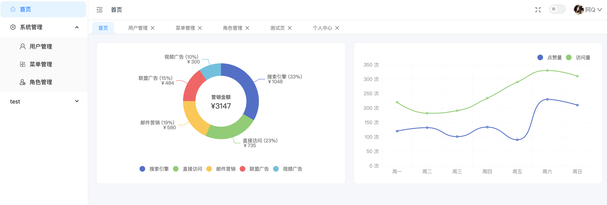

# admin-pure

这是使用vue3、vite5构建的现代化极简后台管理系统模板。它仅包含了最基本的功能，登录、用户管理、角色管理、菜单管理、主题切换，没有任何多余的东西。你可以在此基础上进行二次开发，添加你自己的功能。

## 技术栈

- [Vue3](https://v3.cn.vuejs.org/)
- [Vite5](https://vitejs.dev/)
- [TypeScript](https://www.typescriptlang.org/)
- [Ant Design Vue4](https://next.antdv.com/components/overview-cn/)
- [Vue Router4](https://router.vuejs.org/zh/)
- [Pinia](https://pinia.esm.dev/)
- [Axios](https://axios-http.com/)
- [vueuse](https://vueuse.org/)
- [echarts](https://echarts.apache.org/zh/index.html)
- [dayjs](https://day.js.org/zh-CN/)
- [exceljs](https://github.com/exceljs/exceljs/blob/HEAD/README_zh.md)

## 功能亮点

- 动态路由，根据接口返回的菜单数据动态生成路由；
- 支持按钮级别权限控制，提供了`v-permission`指令与相关hooks、组件；
- 支持明亮、暗黑两种主题模式，并自动跟随系统主题；
- 提供跨组件通信方案`EventBus`，应用了发布订阅者设计模式([查看实现](./src/event/eventBus.ts))；
- 提供了axios封装，内置重复请求解决方案([查看实现](./src/utils/request.ts))；
- 提供了excel生成与导出功能，使用exceljs库([查看实现](./src/plugins/excel.ts))；
- 封装了ant-design-vue的table组件，提供了更友好的类型提示与快捷功能等([查看实现](./src/components/BaseTable/index.vue))；
- 提供`useIdleDetection`hooks，用于检测用户是否处于空闲状态([查看实现](./src/hooks/useIdleDetection.ts))；
- 提供`usePageRequest`hooks，用于处理分页请求的逻辑([查看实现](./src/hooks/usePageRequest.ts))；
- 提供`useQuery`hooks，用于处理查询条件的逻辑([查看实现](./src/hooks/useQuery.ts))；
- 支持回退/缓存查询条件，例如：查询用户列表时，所有的参数都会体现在query参数中，可以通过浏览器的前进后退按钮来切换历史查询条件。

## 快速开始

### 先决条件

- [Node.js](https://nodejs.org/en/) >= 18.0.0
- [pnpm](https://pnpm.io/zh/) >= 6.0.0

### 克隆项目

```sh
git clone https://github.com/wansongtao/admin-pure.git
```

### 安装依赖

```sh
pnpm install
```

### 本地开发

```sh
pnpm dev
```

### 生产构建

```sh
pnpm build
```

## 预览

### 登录页


### 首页



### 用户管理


### 添加菜单


## 许可协议

基于 [MIT](./LICENSE) 许可协议进行开源。

