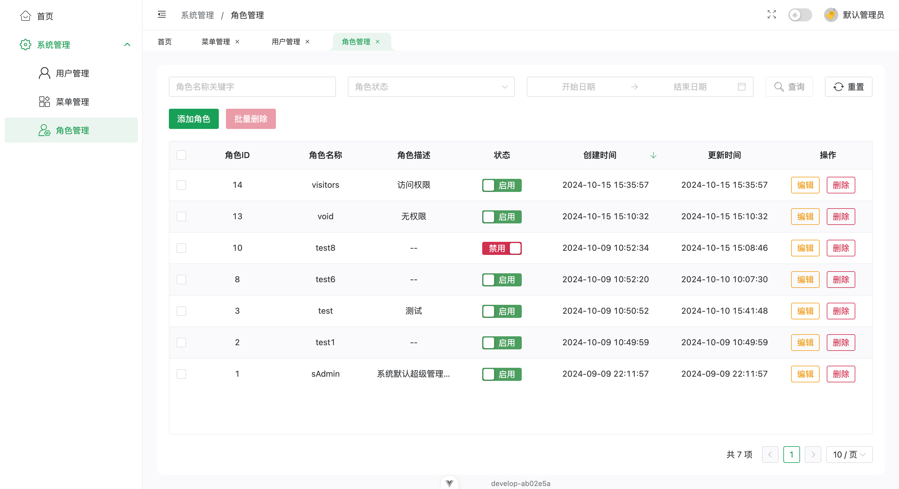

# admin-pure

使用`vue3`、`vite5`、`ts`、`Ant Design Vue4`开发的极简后台管理系统。仅包含基础功能: 登录、菜单管理、角色管理、用户管理。

后端项目地址：[pure-admin-backend](https://github.com/wansongtao/pure-admin-backend)。

## 功能亮点

- 动态路由；
- 按钮级权限控制；
- 支持缓存历史查询条件，刷新网站不丢失当前查询条件，点击浏览器回退按钮回到上一个查询条件；
- axios封装，内置重复请求解决方案、双token无感刷新登录、内置错误优先的请求方法；
- 支持明亮、暗黑两种主题模式，自动跟随系统主题变化；
- 提供跨组件通信方案`EventBus`；
- excel生成与导出方案；
- ant-design-vue的table组件二次封装，提供更友好的类型提示等；
- `usePageRequest`hooks，可用于快速简单地发送分页请求等；
- `useIdleDetection`hooks，可用于检测用户是否处于空闲状态;
- 提供svg图标转换脚本，自动处理单色图标。

## 预览

### 登录页


### 菜单管理


### 角色管理



### 用户管理


## 快速开始

### 先决条件

- [Node.js](https://nodejs.org/en/) >= 18.0.0
- [pnpm](https://pnpm.io/zh/) >= 6.0.0

### 克隆项目

```sh
git clone https://github.com/wansongtao/pure-admin.git
```

### 安装依赖

```sh
pnpm install
```

### 本地开发

```sh
pnpm dev
```

### 生产构建

```sh
pnpm build
```

## 注意事项

菜单对应的组件的`name`属性命名规则：views文件夹下的文件路径+首字母大写。例如：`views/system/user/index.vue`的`name`属性为`SystemUserIndex`。

## 许可协议

[MIT](./LICENSE)
